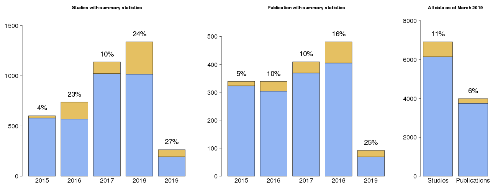

# GWAS Catlog Plots

Collection of scripts to generate various plots based on the data stored in the GWAS Catalog.

## SumStats_wrapper.sh

This script fetches a table from the production database containing the number of studies and publications published in each year. Also studies and publications with summary statistics (`SumStats_fetch_table.py`). The extracted table is saved in a comma separated format eg.: `SummaryStats_table.2019-05-05.csv`. 

**The data looks like this:**

| year | studies | studiesSS | publication | publicationSS |
| :---- | :---- | :---- | :---- | :---- |
| 2005 | 2 | 0 | 2 | 0 |
| 2006 | 8 | 0 | 8 | 0 |
| 2007 | 122 | 1.0 | 89 | 1.0 |
| 2008 | 177 | 0 | 147 | 0 |
| 2009 | 251 | 3.0 | 237 | 3.0 |
| 2010 | 389 | 19.0 | 330 | 9.0 |
| 2011 | 443 | 7.0 | 394 | 7.0 |
| 2012 | 455 | 20.0 | 390 | 15.0 |
| 2013 | 539 | 14.0 | 386 | 11.0 |
| 2014 | 452 | 12.0 | 346 | 4.0 |
| 2015 | 601 | 22.0 | 339 | 16.0 |
| 2016 | 737 | 169.0 | 339 | 35.0 |
| 2017 | 1137 | 117.0 | 409 | 40.0 |
| 2018 | 1338 | 322.0 | 481 | 76.0 |
| 2019 | 263 | 70.0 | 92 | 23.0 |

Then this table is read by `SumStats_plotter.R` and a series of barplots are saved with the current date in their name. Example:

**Usage:** `./SumStats_wrapper.sh -y ${year}` Where the year is the first year to include in the plot.

