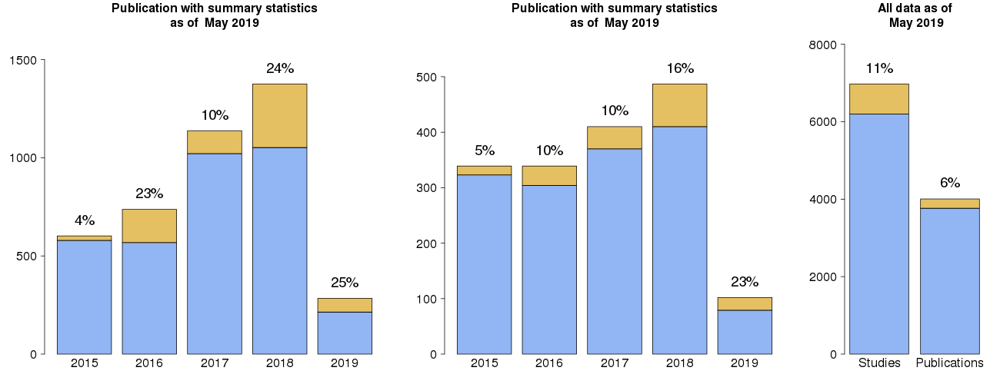
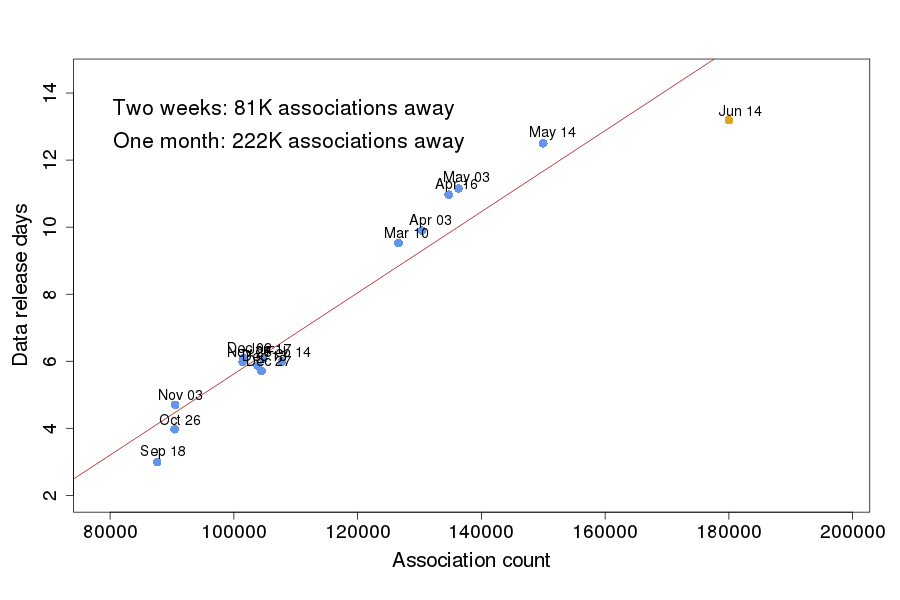

# GWAS Catlog Plots

Collection of scripts to generate various plots based on the data stored in the GWAS Catalog.

## SumStats_plotter.R

`SumStats_fetch_table.py` fetches a table from the production database containing the number of studies and publications published in each year. Also studies and publications with summary statistics. The extracted table is saved in a comma separated format eg.: `examples/SummaryStats_table.2019-05-05.csv`.

**Usage:** `python ./SumStats_fetch_table.py --filename  ${filename}`

The resulting data looks like this:

| year | studies | studiesSS | publication | publicationSS |
| :---- | :---- | :---- | :---- | :---- |
| 2005 | 2 | 0 | 2 | 0 |
| 2006 | 8 | 0 | 8 | 0 |
| 2007 | 122 | 1.0 | 89 | 1.0 |
| 2008 | 177 | 0 | 147 | 0 |
| 2009 | 251 | 3.0 | 237 | 3.0 |
| 2010 | 389 | 19.0 | 330 | 9.0 |
| 2011 | 443 | 7.0 | 394 | 7.0 |
| 2012 | 455 | 20.0 | 390 | 15.0 |
| 2013 | 539 | 14.0 | 386 | 11.0 |
| 2014 | 452 | 12.0 | 346 | 4.0 |
| 2015 | 601 | 22.0 | 339 | 16.0 |
| 2016 | 737 | 169.0 | 339 | 35.0 |
| 2017 | 1137 | 117.0 | 409 | 40.0 |
| 2018 | 1338 | 322.0 | 481 | 76.0 |
| 2019 | 263 | 70.0 | 92 | 23.0 |

Then this table is read by `SumStats_plotter.R` and a series of barplots are generated with the current date in their name. 

**Usage:** `Rscript --vanilla ./SumStats_plotter.R "${startYear}" "${dataTable}"` Where the year is the first year to include in the plot, the table is the output of the previous sript.

## dataReleaseTimer.R

This script creates a plot showing how the lenght of the data release increases as the number of associations in the GWAS Catalog increases.

**Usage:** `Rscript --vanilla ./dataReleaseTimer.R examples/dataRelese.csv YYYY/MM/DD_mmmmm_cccccc`

Where the csv file contains the Date column in `YYYY/MM/DD` format, length of the release process in minutes (Minutes) and the number of associations (assocCount).

Example table (`dataRelese.csv`):

| Date | Minutes | assocCount |
|:------|:------|:------|
| 2018/09/18 | 4312 | 87602 |
| 2018/10/26 | 5717 | 90429 |
| 2018/11/03 | 6767 | 90509 |
| 2018/11/25 | 8612 | 101440 |
| 2018/12/02 | 8782 | 101509 |
| 2018/12/13 | 8458 | 103843 |
| 2018/12/27 | 8222 | 104480 |
| 2019/01/17 | 8736 | 104768 |
| 2019/02/14 | 8630 | 107785 |
| 2019/03/10 | 13719 | 126603 |
| 2019/04/03 | 14251 | 130397 |
| 2019/04/16 | 15796 | 134704 |
| 2019/05/03 | 16063 | 136287 |

