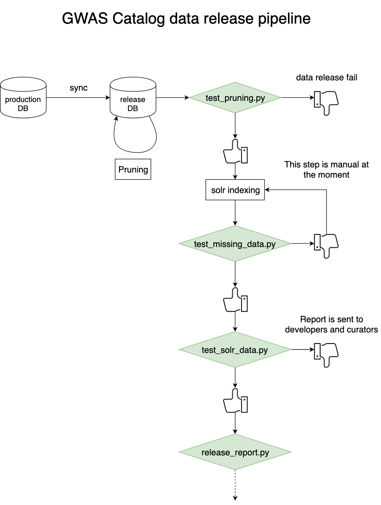

# dataReleaseQC

A set of tools to perform quality control for the [GWAS Catalog](https://www.ebi.ac.uk/gwas) data release. The proper flow of the release is checked at various points for various measures. The integration of these tools into the data release plan is demonstrated in the following diagram:



### Requirements:

The following packages are required:

* [codecs](https://docs.python.org/2/library/codecs.html)
* [pandas](https://pandas.pydata.org)
* [numpy](https://www.numpy.org/)
* [subprocess](https://docs.python.org/2/library/subprocess.html)
* [requests](https://2.python-requests.org/en/master/)

Custom required packages:

* [SolrWrapper](https://github.com/EBISPOT/gwas-utils/tree/master/solrWrapper)
* [gwas_db_connect](https://gitlab.ebi.ac.uk/gwas-catalog/gwas_db_connect/tree/master/gwas_db_connect)

The scripts were written using Python 3.7

## Test pruning

The script checks if the release database was properly pruned, so all remaining studies have accession IDs, and all studies are 'published' in the housekeeping table: `HOUSEKEEPING.IS_PUBLISHED = 1`

#### Usage:

```bash
python test_pruning.py --databaseInstance <release database instance name>
```

If the provided database instance has unpruned studies the script exists with a non-zero exit status making the data release plan fail. This is a critical problem that should lead to the termination of the release process.


#### Test missing data

This script tests if any study or association in the release database is not indexed in solr. If any such study or association is found, the script exists with a non-zero exit status leading to the termination of the release process. It is possible to add these missing studies back to the solr index, but it is manual, not yet automated. However the script provides the list of missing studies and pubmed IDs.

#### Usage:

```bash
python test_missing_data.py \
    --solrAddress <solr address> \
    --solrPort <solr port> \
    --solrCore <gwas solr core> \
    --releaseDB <release database instance>
```

solr address is specified eg. `http://localhost`

#### Example output:

```
[INFO] Database connection was successful
[INFO] Extracting data from spotrel
[INFO] Closing connection.
[INFO] Extracting data from: garfield.ebi.ac.uk:8983
[Warning] Association count does not match: 157336 in the release db vs. 121000 in the solr.
[Warning] Study count does not match: 7661 in the release db vs. 7641 in the solr.
[Warning] 20 studies are missing from the solr index.
[Warning] From publication with PMID 20351715, the following studies are missing: GCST006582
[Warning] From publication with PMID 28548082, the following studies are missing: GCST004761
[Warning] From publication with PMID 22837380, the following studies are missing: GCST001622
[Warning] From publication with PMID 22841784, the following studies are missing: GCST001623
[Warning] From publication with PMID 29503163, the following studies are missing: GCST006293,GCST006294,GCST006285,GCST006295,GCST006296,GCST006297,GCST006298
[Warning] From publication with PMID 29562276, the following studies are missing: GCST005815
[Warning] From publication with PMID 29625478, the following studies are missing: GCST005589
[Warning] From publication with PMID 29615537, the following studies are missing: GCST005763,GCST005764
[Warning] From publication with PMID 29521573, the following studies are missing: GCST005709,GCST005708,GCST005707,GCST005706
[Warning] From publication with PMID 30207284, the following studies are missing: GCST007358
```

In this example the solr index generation was still in progress that's why it was not complete. The output of this script can be used to extract the pubmed IDs of the publications that were missed from the indexing and add them manually.

## Test solr data

This script performs a set of tests to validate the internal consistency of the newly generated solr index. At this point only two such tests are implemented: one tests if there are any EFO traits that are not fetched from OLS, the other tests if any of the internally stored EFO label is different from what is fetched from OLS. If any such trait is found, a report is sent to the provided email addresses. But the exit status of the script is still zero, allowing the release process to continue.

#### Usage:

```bash
python test_solr_data.py --solrHost <host name of the solr server> \
    --solrPort <port on which the solr server is listening> \
    --solrCore <solr core to test> \
    --solrHost <email addresses>
```

## Generate report of the new release

A script that generates a report of the new data release. The report contains incremental changes (newly added or retracted studies), which is generated by compairing the new and an old version of the solr index. Once the report is generated the file is then copied to the ftp location of the release and is made available through the downloads page of the [UI](https://www.ebi.ac.uk/gwas/docs/file-downloads)


#### Usage:

```bash
python data_release_report.py  --oldSolrAddress <host name of the old solr> \
    --oldSolrPort <port name of the old solr> \
    --newSolrAddress <host name of the new solr> \
    --newSolrPort <port name of the new solr> \
    --solrCore <solr core name> \
    --emailAddress <email addresses>
```

Where solr addresses are specified like: `http://localhost:8983`

## Stats file generator

This script generates stats file that the UI reads and display (date of release, association count etc.).

#### Usage:

```bash
python stats_file_generator.py --propertiesFile <prop_file> \
    --filename <outputFile> \
    --dbInstance <instance_name>
```

Where:

* `propertiesFile` - The application property file of the remapper application to fetch the path to the URL of the currently used Ensembl REST API. This is required to get the current Ensembl release version onto which the GWAS Catalog data is mapped.
* `outputFile` - Path and file name of the output file. It must be discoverable by other components of the data release plan.
* `instance name` - The name of the release database to extract the number of publications and associations in the release.

Output:

```
dbsnpbuild=151
studycount=4220
associationcount=157336
genomebuild=GRCh38.p12
releasedate=2019-09-24
snpcount=107486
ensemblbuild=96
```

It is important to highlight that the study count is not referring to studies but publications!!! This should be updated in the [gwas-ui](https://github.com/EBISPOT/gwas-ui) code as well to make sure it is more intuitive to maintain.

## More information

For more information see [confluence page](https://www.ebi.ac.uk/seqdb/confluence/display/GOCI/dataReleaseQC+tool).
