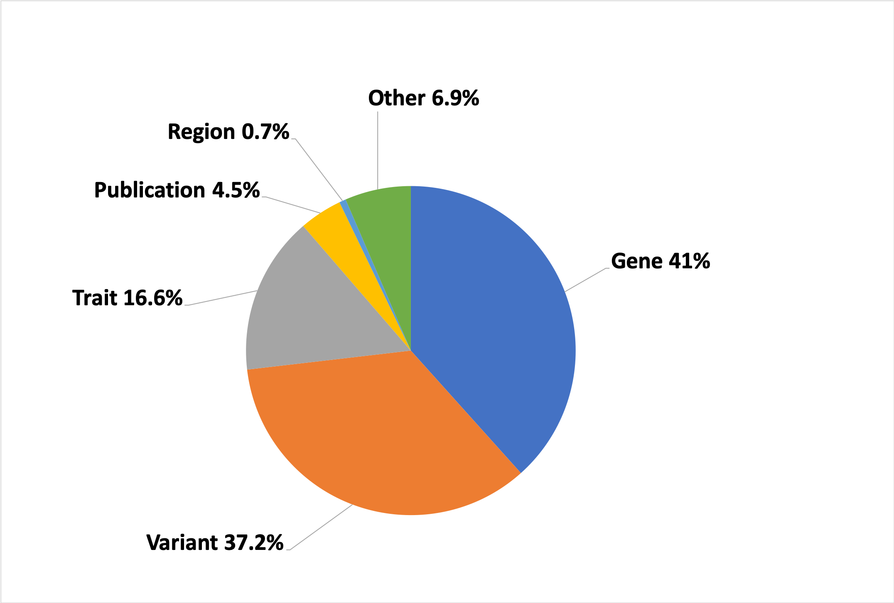

# Search term classifier

This script was written in an effort to gain a better idea on the user behaviour. To adjust the priorities of the development of the user interface, we wanted to know what do users of the GWAS Catalog search for. For this purpose we used the tomcat access logs. The logfiles were parsed using the [log-analysis](https://github.com/EBISPOT/gwas-utils/tree/master/log-analysis) script to get the list of all searched terms and the number of how many that term was queried.

Then this script parses these search terms tries to classify into one of the main categories (eg. `pubmed ID`, `gene`, `variant` etc.). 

## Usage

```bash
./search_classifier.pl \
    -geneFile gene_list.txt \
    -traitFile unique_trait_terms.lst \
    -ancestryFile combined_ancestry_related_terms.txt \
    -consortiaFile consortia_list.txt \
    -logFile search_2018-10-01-2019-09-30_queries.tsv 
```

Where 

* **geneFile**: list of gene names, identifiers and synonyms
* **traitFile**: list of trait terms
* **ancestryFile**: list of ancestry/ethnic related terms
* **consortiaFile**: list of consortium names eg. MAGIC, GIANT 
* **logFile**: list of search terms with search counts.


## Generating input files

### log file

This file was generated by [log-analysis](https://github.com/EBISPOT/gwas-utils/tree/master/log-analysis).

```
355864  rs7329174
10619   breast%20carcinoma
2607    schizophrenia
2570    body%20mass%20index
2216    obesity
2103    diabetes
2068    breast%20cancer
1916    asthma
1862    Alzheimer%27s%20disease
1820    multiple%20sclerosis
```

Where the first column shows a term how many times were queried.

### geneFile


```bash
# Downloading GENCODE data:
wget -q ftp://ftp.ebi.ac.uk/pub/databases/gencode/Gencode_human/release_31/gencode.v31.annotation.gtf.gz

# Downloading Entrez gene info:
wget -q ftp://ftp.ncbi.nih.gov/gene/DATA/GENE_INFO/Mammalia/Homo_sapiens.gene_info.gz

cat <(zless gencode.v31.annotation.gtf.gz | grep -v "#"| awk '$3 == "gene"' \
   | perl -lane 'print $1 if $_ =~ /gene_name "(.+?)"/' )\
   <(zless Homo_sapiens.gene_info.gz  | grep -v "#" | perl -lane 'print  join "\n", $F[2], split(/\|/, $F[4])') \
   | perl -lane '$_ =~ s/\.\d+$//; $_ =~ s/\.$//; print $_ if length($_) >= 3' | sort -u > gene_list.txt

echo "[Info] Combined gene term list:" $(cat gene_list.txt | wc -l)
```

```
[Info] Combined gene term list: 134098
```

### traitFile

Identifying traits is tricky. First we generate a large dictionary of possible trait names and look up the search terms.


```bash
# Extracting all traits, reported traits, synonyms etc:
curl -s "${solrHost}:8983/solr/gwas_slim/select?q=resourcename%3Atrait&rows=2467&fl=parent%2CmappedTrait%2C+synonyms%2C+reportedTrait&wt=json&indent=true" | jq -r '.response.docs' > traits.json


# Reading json in perl and get a unique list of all the trait terms:
./trait_parser.pl traits.json | sort > unique_trait_terms.lst

# Generating a list of words typical for phenotypes:
cat unique_trait_terms.lst <(echo "als aids area acne age stroke measurement bmi barr blue body levels bone copd cold deep disc down ear eye egg fast fear food fat \
    foot free grout gray hiv hpv hair hand head height high hip lead lean iris iron ratio itch knee left lewy life lip \
    lobe low lung levels mmr mri male mean activity status adenocarcinoma cinoma mild milk mood oral pet pain peak poor post rate red sex skin stem sum type \
    urea uric vein very zinc ward word acid air area aura band base beta dose drop diet born cell drug dust eyes \
    face flow gain germ grip hay hand hair heel heme jaw late legs load meal anger agression parkinsons \
    body bmi adhd measure rheumatoid alzheimer renal crohn fat factor gamma height Parkinsons hyperinsulinemia \
    hiv hepatitis hypertension pulmonary hdl serum schizophrenia sensitivity hyperlipidemia dyslipidemia IQ \
    ldl skin stroke  stomach systemic substance systolic survival crohns ptsd lactase salt retinoblastom \
    level total thyroid thioredoxin concentrations viral als event waist vitamin vitemin birthweight \
    vitami vitamine vitamina density function Response disease symptom degeneration hemophilia \
    chron failure cancer obesity ibd sarcoma blood lymphoma association risk syndrome deafness breastcancer \
    disorder type diabetes t2d t1d" | tr " " "\n" ) | sort -u | awk 'NF != 0' | sponge unique_trait_terms.lst
    
echo "[Info] Size of the combined term list:" $(cat unique_trait_terms.lst | wc -l)
```

```
[Info] Size of the combined term list: 14826
```


### ancestryFile

if a search term matches a country name or a known ethnic group or ancestry definition. Where do we have the list of such terms.

1. GWAS Catalog ancestry file from the [download](https://www.ebi.ac.uk/gwas/docs/file-downloads): 

    ```bash
    curl -s 'https://www.ebi.ac.uk/gwas/api/search/downloads/ancestry' | cut -f9,10,11 \
        | perl -F"\t" -MData::Dumper -lane '
            foreach $field (@F){
                next if $field eq "NR";
                @elements = split (", ", $field);
                foreach $element (@elements){
                    next if $element eq "NR";
                    $h{$element} ++;
                }
            }; END {
                print join "\n", keys %h;
            }' | sort -u > ancestry_related_terms_GWAS_Cat.txt
    echo "[Info] Number of unique ancestry related terms: " $(cat ancestry_related_terms_GWAS_Cat.txt | wc -l )
    ```

    ```
    [Info] Number of unique ancestry related terms:  157
    ```

2. A full list of countries was also downloaded:

    ```bash
    curl -s https://www.searchify.ca/wp-content/uploads/2016/09/country-keyword-list.csv > country-keyword-list.csv
    dos2unix country-keyword-list.csv
    echo "[Info] Number of countries: " $(cat country-keyword-list.csv | wc -l)
    ```

    ```
    [Info] Number of countries:  209
    ```

3.  A list of all known ethnicities from [wikipedia](https://en.wikipedia.org/wiki/List_of_contemporary_ethnic_groups): The table is copy-pasted to a spreadsheet, then extensively cleaned to remove non-standard whitespaces and special characters. As the file contain a huge number of ethnic definition, areas of ethnic prevalences, some misleading terms needs to be excluded: eg. iron. Also there are handful of ethnicities with short names that are happen to be gene names as well.

    ```bash
    tail -n+2 ethnic_groups.txt \
    | perl -F"\t" -lane 'foreach $f (@F){ 
            next if $_ =~ /^\s+$/; 
            foreach $g (split ",", $f){ 
                $g =~ s/^\s*|$\s*//g; 
                $h{$g} = 1 unless length $g < 3; 
            }
        }
        END {
            foreach $g (keys %h){
                print lc $g;
            }
        }' | sort -u | grep -v iron > cleaned_ethnic_groups.txt
        
    echo "[Info] Number of unique ethnic groups: " $(cat cleaned_ethnic_groups.txt | wc -l)
    ```

    ```
    [Info] Number of unique ethnic groups:  2317
    ```

4. Merging the previously generated files:

    ```bash
    cat ancestry_related_terms_GWAS_Cat.txt \
    country-keyword-list.csv \
    cleaned_ethnic_groups.txt \
    | sort -u > combined_ancestry_related_terms.txt
    
    echo "[Info] Combined ancestry related terms:" $(cat combined_ancestry_related_terms.txt | wc -l)
    ```

    ```
    [Info] Combined ancestry related terms: 2574
    ```

### consortiaFile

Generation of the consortia file: manually assembled based on searches... currently there's no systematically assembled database.

## Classes

* **ancestry** : perfect match for a ancestry term.
* **author** : Search terms where a word is followed by one or two letters. eg. `Prins B.` The following words are not considered in this classification: `vitamin`, `hepatitis`, `cystatin`, `apolipoprotein`.
* **consortia** : perfect match for a consortia term or contains the word consort or biobank.
* **cytoband** : Cytological bands are also a reasonably frequent search terms. Terms that look like this: `xq12.4` or `12p53` are considered as cytological bands.
* **gene** : Genes are among the most frequently searched terms. Unfortunately users are search by IDs from different databases, synonyms etc. Dictionary with all known gene names/IDs are generated. Perfect match is required.
* **pmid** : Finding pubmed ID is not easy. There are a lot of numbers in general: genomic region, rsID, gene ID etc. So a number is considered to be a pubmed ID if it has only 8 digits starting with 1,2 or 3. Does not have `rs`, `kgp`, `exm`, `ensg` or does not look like a chromosome: `X:2039203`
* **region** : A search term is considered to be a genomic region if it has a chromosome (1..22,x,y) followed by `:`, number, then `-` then number again.
* **study** : A search term is considered to be study if it looks like this: `GCST####`
* **trait** : perfect match for a trait term.
* **variant** : Variants are marked by several different ways: rsID, KGP, EXM ID or chromosome:position.
* **unclassified** : A term is unclassified if none of the above critera was satisfied.

## Excluded terms

Queries we are displaying on the front search page were omitted from the counting:

* breast carcinoma
* rs7329174
* Yao
* 2q37.1
* HBS1L
* 6:16000000-25000000

## Output

The script prints results onto the standard output + creates files for all categories where the classified terms are saved.

**General report**: gives a very broad overview of the classifications:

```
[Info] Number of search summarized: 1730534
[Info] Number of excluded searches: 372039
[Info] Number of search terms: 347486
[Info] Number of terms that could not be classified: 58391 (16.8%), representing 113365 (6.6%) searches.
```

The `Number of excluded searches` gives the number of times users click on the example search terms that are listed under the main search bar. We excluded these events as they would highly skew the distribution.

**Classification result**: gives the distribution of searches across all the implemented classes.

```
[Info] reporting the distribution of searches across all classes:
region       - 6462    (0.37%)
gene         - 676788  (39.11%)
author       - 15070   (0.87%)
cytoband     - 5026    (0.29%)
ancestry     - 500     (0.03%)
trait        - 273777  (15.82%)
variant      - 613783  (35.47%)
unclassified - 113365  (6.55%)
consortia    - 412     (0.02%)
study        - 3933    (0.23%)
pmid         - 55051   (3.18%)
```

It is important to note that these numbers are number of queries not number of terms!

**Overlap of classes**: some terms can be classified into multiple categories (most likely genes can be traits as measured trait) To see how ambigious the classification is, we want to see how many terms are assigned to more than one terms. 

```
[Info] The following table shows the abmiguity of the classification.
[Info] It shows how many of the terms, and searches were classified into 0,1,2 or more casses.
Assigned_class  Terms   Search_count
0               58391   113365
1               278250  1583551
2               10831   33604
3               13      13
4               1       1
```

Apparently it's very low number: 3.1% of terms are assigned to more than one tems representing 1.9% of queries. That's good.

## Plot

The classified searches ca be summarized in a pie chart:



 * The region is pooled with cytogenetic bands
 * Pubmed ID, GWAS study is pooled with authors as "Publication"
 * Unclassified (6.5%) is pooled with consortia (0.02%) and ancestry (0.03%) as "Other"


